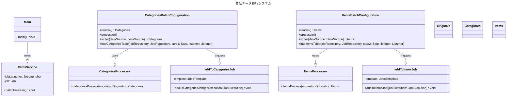
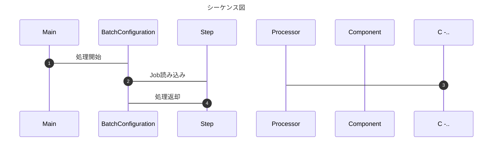

# クラス図・シークエンス図

## クラス図

```mermaid

---
title: 商品データ移行システム
---
classDiagram
direction lr
    class ItemsService {
        -jobLauncher: JobLauncher
        -job: Job
        +batchProcess() void
    }
    
    class Main {
        +main() void
    }
    
    class CategoriesBatchConfiguration {
        +reader() Categories
        +processor()
        +writer(dataSource: DataSource) Categories
        +intoCategoriesTable(jobRepository: JobRepository, step1: Step, listener: Listener)
    }
    
    class ItemsBatchConfiguration {
        +reader() Items
        +processor()
        +writer(dataSource: DataSource) Items
        +intoItemsTable(jobRepository: JobRepository, step2: Step, listener: Listener)
    }
    
    class CategoriesProcessor {
        +categoriesProcess(originals: Originals) Categories
    }
    
    class ItemsProcessor {
        +itemsProcess(originals: Originals) Items
    }
    
    class addToCategoriesJob {
        -template: JdbcTemplate
        +addToCategoriesJob(jobExecution: JobExecution) void
    }
    
    class addToItemsJob {
        -template: JdbcTemplate
        +addToItemsJob(jobExecution: JobExecution) void
    }
    
    class Originals {
    }
    
    class Categories {
    }
    
    class Items {
    }
    
    Main --|> ItemsService : uses
    CategoriesBatchConfiguration --|> CategoriesProcessor : uses
    ItemsBatchConfiguration --|> ItemsProcessor : uses
    CategoriesBatchConfiguration --|> addToCategoriesJob : triggers
    ItemsBatchConfiguration --|> addToItemsJob : triggers
```

```mermaid
---
title: シーケンス図
---
sequenceDiagram
autonumber

participant A as Main
participant B as BatchConfiguration
participant C as Step
participant D as Processor
participant E as Component

A -> B : 処理開始
B -> C : Job読み込み
C -..-> D : 
C -> B : 処理返却


```
