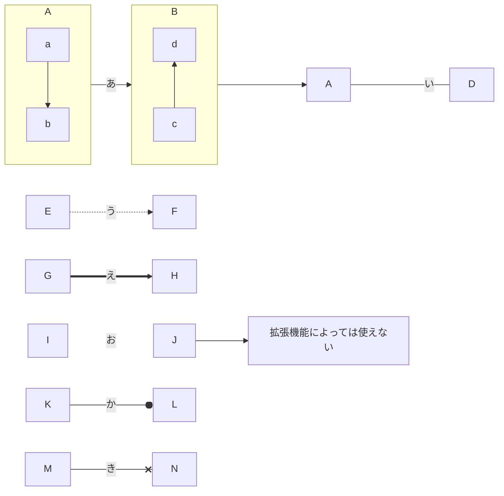
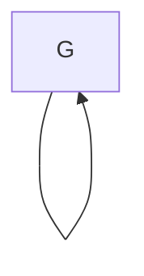

# クラス図・シークエンス図

```mermaid
flowchart LR
    A --あ--> B
    C --い--- D
    E -.う.-> F
    G ==え==> H
    I ~~~|お| J -->拡張機能によっては使えない
    K --か--o L
    M --き--x N

    subgraph A
        direction TB
    a --> b
    end
    subgraph B
        direction BT
    c --> d
    end

    B[A]
    C[A]

    B --> C
```

```mermaid
flowchart

G --> G
```
