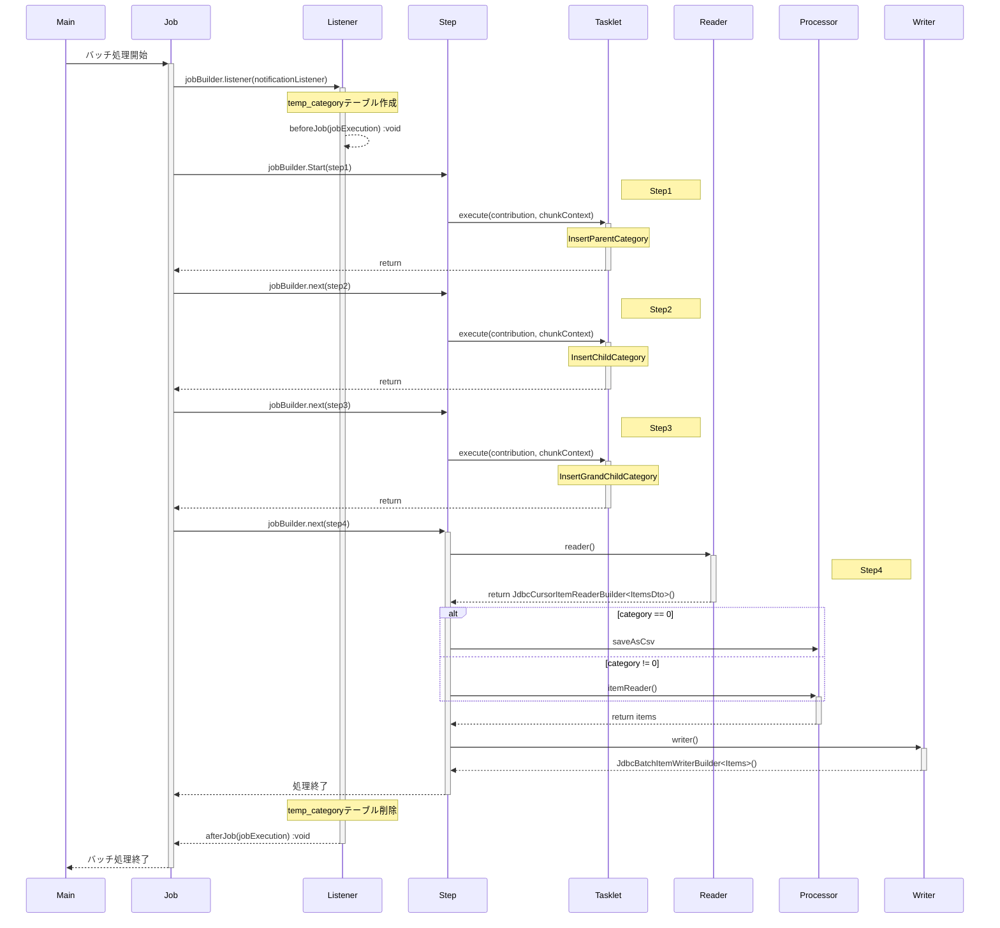

```mermaid
classDiagram
    Main --> ImportTableConfiguration

    DataSourceConfiguration <--> ImportTableConfiguration
    
    ImportTableConfiguration --> InsertParentTasklet
    ImportTableConfiguration --> InsertChildTasklet
    ImportTableConfiguration --> InsertGrandChildTasklet

    ImportTableConfiguration --> ChunkCountingListener
    ImportTableConfiguration --> JobCompletionNotificationListener
    ImportTableConfiguration --> StepCompletionNotificationListener

    ImportTableConfiguration --> ReaderConfig

    ItemCategoryCheckProcessor <-- ItemsDto

    ItemCategoryCheckProcessor --> MakeCsvFile

    ReaderConfig --> ItemsDto
    ItemCategoryCheckProcessor -->Items

    WriterConfig <-- Items

    ImportTableConfiguration --> ItemCategoryCheckProcessor

    ImportTableConfiguration --> WriterConfig

    class DataSourceConfig {
        + DataSource dataSource()  dataSourceBuilder.build()
    }

    class ImportTableConfiguration{
        + ItemCategoryCheckProcessor processor (itemsDto) new ItemCategoryCheckProcessor()
        + Job moveToOriginalsJob(jobRepository,step1,step2 ,step3,step4,notificationListener) new JobBuilder("moveToOriginalsJob", jobRepository)
                                .listener(notificationListener)
                                .start(step1)
                                .next(step2)
                                .next(step3)
                                .next(step4)
                                .build();
        + Step step1(jobRepository,transactionManager,template,tasklet1) StepBuilder("step1", jobRepository)
                                .tasklet(tasklet1, transactionManager)
                                .build()
        + Step step2(jobRepository,transactionManager,template,tasklet2) StepBuilder("step1", jobRepository)
                                .tasklet(tasklet3, transactionManager)
                                .build()
        + Step step3(jobRepository,transactionManager,template,tasklet3)
        + Step step4(jobRepository,transactionManager,stepListener,processor,listener) StepBuilder("Step2", jobRepository)
                                .~ItemsDto, Items~chunk(10000, transactionManager)
                                .listener(stepListener)
                                .listener(listener)
                                .reader(itemReader)
                                .processor(processor)
                                .writer(itemWriter)
                                .build()
        - JdbcCursorItemReader<ItemsDto> itemReader
        - JdbcBatchItemWriter<Items> itemWriter

    }
    class InsertParentTasklet{
        - TransactionTemplate transactionTemplate
        - final JdbcTemplate jdbcTemplate
        + InsertParentTasklet(jdbcTemplate, transactionTemplate)
        + RepeatStatus execute(contribution,chunkContext) RepeatStatus.FINISHED
    }

    class InsertChildTasklet{
        - TransactionTemplate transactionTemplate
        - final JdbcTemplate jdbcTemplate
        + InsertChildTasklet(jdbcTemplate, transactionTemplate)
        + RepeatStatus execute(contribution,chunkContext) RepeatStatus.FINISHED
    }

    class InsertGrandChildTasklet{
        - TransactionTemplate transactionTemplate
        - final JdbcTemplate jdbcTemplate
        + InsertGrandChildTasklet(jdbcTemplate, transactionTemplate)
        + RepeatStatus execute(contribution,chunkContext) RepeatStatus.FINISHED
    }

    class StepCompletionNotificationListener{
        + ExitStatus afterStep(stepExecution) null
        }

    class ChunkCountingListener{
        + void afterChunk(chunkContext)
        + void afterChunkError(chunkContext)
    }

    class JobCompletionNotificationListener{
        - JdbcTemplate template
        + JobCompletionNotificationListener(template)
        + void beforeJob(jobExecution)
        + void afterJob(jobExecution)
    }

    class ReaderConfig{
        - DataSource dataSource
        + ReaderConfig(dataSource)
        + JdbcCursorItemReader~ItemsDto~ itemReader() JdbcCursorItemReaderBuilder~ItemsDto~()                .dataSource(dataSource)
                .name("importData")
                .sql(SELECT_ORIGINALS)
                .rowMapper(ITEMS_ROW_MAPPER)
                .build()
    }

    class ItemCategoryCheckProcessor{
        - MakeCsvFile makeCsvFile
        + Items process(itemsDto) items
    }

    class MakeCsvFile{
        - String toCsv(itemDto) stringBuilder.toString()
        + void saveAsCsv(itemsDto,filePath)
    }

    class WriterConfig{
        - DataSource dataSource
        + WriteConfig(dataSource)
        + JdbcBatchItemWriter~Items~ itemWriter() JdbcBatchItemWriterBuilder<Items>()
                .sql(INSERT_INTO_ITEMS)
                .dataSource(dataSource)
                .beanMapped()
                .build()
    }

    class ItemsDto{
        - Integer id;
        - String name;
        - Integer conditionId;
        - Integer category;
        - String nameAll;
        - String brand;
        - Double price;
        - Integer shipping;
        - String description;
        + ItemsDto()
    }

    class Items{
        - Integer id;
        - String name;
        - Integer conditionId;
        - Integer category;
        - String brand;
        - Double price;
        - Integer shipping;
        - String description;
        + Items() 
    }


```

```mermaid

sequenceDiagram
    Main ->>+ Job: バッチ処理開始
    Job ->>+ Listener: jobBuilder.listener(notificationListener)
    Note over Listener: temp_categoryテーブル作成
    Listener -->> Listener: beforeJob(jobExecution) :void


    Job ->> Step: jobBuilder.Start(step1)
    Note right of Tasklet: Step1
    Step ->>+ Tasklet: execute(contribution, chunkContext)
    Note over Tasklet: InsertParentCategory
    Tasklet -->>- Job: return


    Job ->> Step: jobBuilder.next(step2)
    Note right of Tasklet: Step2
    Step ->>+ Tasklet: execute(contribution, chunkContext)
     Note over Tasklet: InsertChildCategory
    Tasklet -->>- Job: return


    Job ->> Step: jobBuilder.next(step3)
    Note right of Tasklet: Step3
    Step ->>+ Tasklet: execute(contribution, chunkContext)
    Note over Tasklet: InsertGrandChildCategory
    Tasklet -->>- Job: return

       

    Job ->>+ Step: jobBuilder.next(step4)

    Step ->>+ Reader: reader()


    Note right of Processor: Step4
    Reader -->>- Step: return JdbcCursorItemReaderBuilder<ItemsDto>()

    alt category == 0
        Step ->> Processor: saveAsCsv
    else category != 0
        Step ->>+ Processor: itemReader()
    end
         Processor -->>- Step: return items

    Step ->>+ Writer: writer()
    Writer -->>- Step: JdbcBatchItemWriterBuilder<Items>()

    Step -->>- Job: 処理終了
    Note over Listener: temp_categoryテーブル削除
    Listener -->>- Job: afterJob(jobExecution) :void
    Job -->>- Main: バッチ処理終了

    
```
